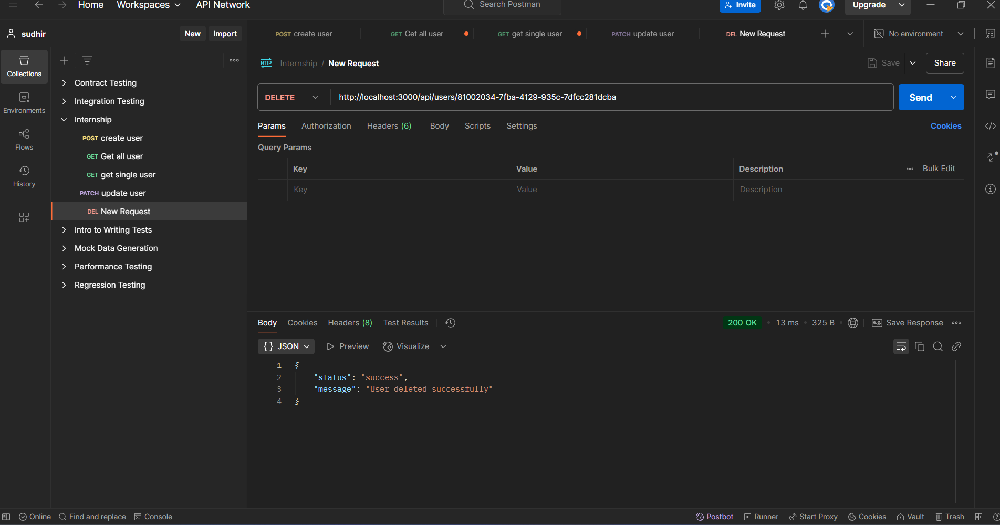

# 👥 User Management API

A simple 🌐 RESTful API for 🏗️ user management built with ⚡ Express.js. This API provides 🔄 CRUD operations for managing 🗃️ user data with 💾 in-memory storage.



## ⭐ Features

- ✍️ Create, 📖 Read, ✏️ Update, and ❌ Delete users
- 🆔 UUID generation for unique user IDs
- 📧 Email validation
- ❗ Basic error handling
- 💾 In-memory data storage

## 📌 Prerequisites

- ⚙️ Node.js (v14 or higher)
- 📦 npm (Node Package Manager)

## 🔧 Installation

### ⬇️ Clone the repository

```sh
git clone <your-repo-url>
cd user-management-api
```

### 📦 Install dependencies

```sh
npm install
```

### 🚀 Start the server

#### 🛠️ Development mode with 🔄 nodemon
```sh
npm run dev
```

#### 🚀 Production mode
```sh
npm start
```

The server will start on 🔢 port 3000 by default.

## 🔌 API Endpoints

### ✍️ Create User

📩 **POST** `/users` - Creates a new 🆕 user

#### 📥 Request body:
```json
{
    "name": "John Doe",
    "email": "john.doe@example.com",
    "age": 30
}
```

#### 📤 Response (201):
```json
{
    "id": "uuid",
    "name": "John Doe",
    "email": "john.doe@example.com",
    "age": 30
}
```

### 📖 Get All Users

📩 **GET** `/users` - Returns a 📋 list of all users

#### 📤 Response (200):
```json
[
    {
        "id": "uuid",
        "name": "John Doe",
        "email": "john.doe@example.com",
        "age": 30
    },
    {
        "id": "uuid",
        "name": "John Don",
        "email": "john.Don@example.com",
        "age": 35
    }
]
```

### 🔍 Get Single User

📩 **GET** `/users/:id` - Returns a 🧑 single user by 🆔 ID

#### 📤 Response (200):
```json
{
    "id": "uuid",
    "name": "John Doe",
    "email": "john.doe@example.com",
    "age": 30
}
```

### ✏️ Update User

📩 **PUT** `/users/:id` - Updates an existing 🧑 user

#### 📥 Request body (all fields optional):
```json
{
    "name": "John Smith",
    "email": "john.smith@example.com",
    "age": 31
}
```

#### 📤 Response (200):
```json
{
    "id": "uuid",
    "name": "John Smith",
    "email": "john.smith@example.com",
    "age": 31
}
```

### ❌ Delete User

📩 **DELETE** `/users/:id` - Deletes a 🗑️ user

#### 📤 Response (204): No content

## ⚠️ Error Handling

The API handles various 🚨 error cases:

- ❌ 400 Bad Request: Invalid input data
- 🔍 404 Not Found: User not found
- 🛑 500 Internal Server Error: Server errors

#### ❗ Error Response Format:
```json
{
    "error": "Error message here"
}
```

## 🧪 Testing with Postman

- 📥 Import the provided 📨 Postman collection
- 🔬 Test each endpoint:
  - ✍️ Create a new user
  - 📖 Get the list of users
  - 🔍 Get a single user using the ID from creation
  - ✏️ Update the user
  - ❌ Delete the user

## 📂 Project Structure

```
user-management-api/
├── config/
│   └── db.js
├── models/
│   └── User.js
├── controllers/
│   └── userController.js
├── routes/
│   └── userRoutes.js
├── middleware/
│   └── errorHandler.js
├── .env
├── .gitignore
├── package.json
└── server.js
```

## 📦 Dependencies

- ⚡ express: Web framework
- 🆔 uuid: For generating unique IDs
- 🔄 nodemon (dev dependency): For development auto-reload

## 🛠️ Scripts

```sh
npm start    # 🚀 Start the server
npm run dev  # 🛠️ Start the server with nodemon for development
```

## 🤝 Contributing

1. 🍴 Fork the repository
2. 🌱 Create your feature branch
3. 💾 Commit your changes
4. 📤 Push to the branch
5. 🔀 Create a new Pull Request

